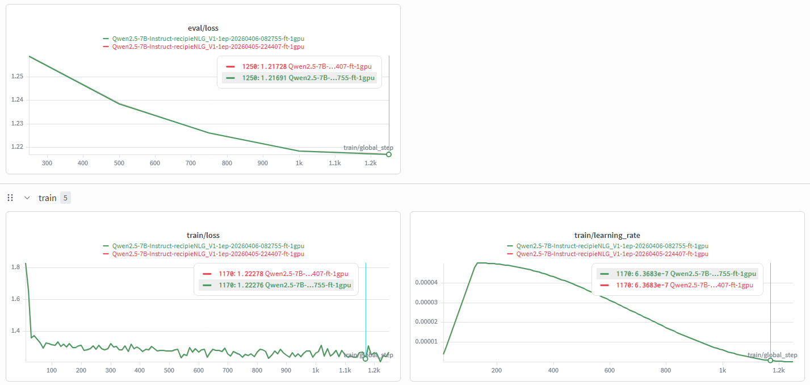

# Methodology

This document describes the full experimental design for `qwen-recipe-generation-finetuning` — covering research questions, dataset decisions, training configuration, prompt design, evaluation strategy, results interpretation, and limitations.

For supplementary detail see:
- [`docs/recipe-dataset-eda-report.md`](docs/recipe-dataset-eda-report.md) — full EDA and dataset cleaning narrative
- [`docs/recipe-evaluation-pipeline-blog-post.md`](docs/recipe-evaluation-pipeline-blog-post.md) — evaluation pipeline design
- [`docs/recipe-evaluation-functions-sequence.md`](docs/recipe-evaluation-functions-sequence.md) — function-level evaluation sequence

---

## 1. Research Questions

This project set out to answer four concrete questions:

**RQ1:** Does supervised fine-tuning on RecipeNLG improve recipe generation quality over the base Qwen2.5-7B-Instruct model, as measured by both deterministic and LLM-as-judge metrics?MOre over can we use this to generate recipes that are actually usable?. and use it for a web or mobile application?

**RQ2:** Does LoRA rank (r=16 vs r=32) meaningfully affect generation quality or training efficiency at this scale?Does Learning rate scheduling impact the final model quality?

**RQ3:** How does LLM-as-judge evaluation compare to deterministic metrics (BLEU, ROUGE, ingredient F1) as a signal of recipe usability?

**RQ4:** What are the dominant failure modes of a fine-tuned recipe generation model, and can they be diagnosed from structured evaluation outputs?

---

## 2. Dataset

**Source:** RecipeNLG — 2M+ semi-structured cooking recipes  
**Working subset:** ~93,000 recipes after quality filtering — 80,000 training samples, 3,000 validation samples, 10,000 test samples

### 2.1 Why the raw dataset needed cleaning

The RecipeNLG dataset is rich but not immediately suitable for instruction tuning. Key issues discovered during EDA:

- Recipe titles are **not unique identifiers** — common titles like "Chicken Casserole" appear hundreds of times with different ingredient lists and directions
- Ingredient text contains substantial **surface-level noise**: unit abbreviations (`c`, `tbsp`, `tsp`), unicode fractions, inconsistent punctuation, parenthetical comments, and repeated whitespace
- A meaningful proportion of recipes are **structurally suspicious**: too few ingredients, too few steps, malformed direction fields, or implausible token counts
- **Near-duplicate recipes** are common enough to affect dataset splitting if not handled explicitly

### 2.2 Cleaning decisions

Filtering thresholds were not chosen arbitrarily — each was informed by inspecting outlier rows and verifying that removed examples were genuine dataset noise rather than valid edge cases:

```python
# Structural filters
min_ingredients = 3,  max_ingredients = 100
min_directions_chars = 10, max_directions_chars = 10_000
min_input_tokens = 5, min_output_tokens = 10, max_output_tokens = 1_500

# Gold subset (used for fine-tuning)
min_input_tokens = 20
60 <= output_tokens <= 800
output_to_input_ratio <= 6
total_tokens <= 1_024
```

### 2.3 Deduplication strategy

Standard random splitting was rejected because title-based deduplication is unreliable. Instead, the cleanup notebook used **blocked MinHash clustering over normalized ingredients**:

1. Titles were normalized and grouped by prefix
2. Ingredient overlap signatures were computed per recipe
3. Recipes were assigned to ingredient-based clusters
4. Train/validation/test splits were performed **at the cluster level**, ensuring similar recipes stayed in the same split

This prevented leakage of near-duplicate recipes across splits, making evaluation results more trustworthy.

### 2.4 Final dataset splits

| Split | File | Size |
|---|---|---|
| Train | `train_gold_80k.jsonl` | 80,000 samples |
| Validation | `val_3k.jsonl` | 3,000 samples |
| Test | `test_10k.jsonl` | 10,000 samples |

Both ID overlap and cluster overlap between splits were explicitly verified as zero.

---

## 3. Training Configuration

### 3.1 Base model & framework

| Setting | Value |
|---|---|
| Base model | Qwen2.5-7B-Instruct |
| Fine-tuning framework | [Unsloth](https://github.com/unslothai/unsloth) |
| PEFT library | HuggingFace PEFT |
| Inference | vLLM |
| Compute | RunPod |
| Precision | bfloat16 (auto-detected via `is_bfloat16_supported()`) |
| Quantization | None (`load_in_4bit = False`, `load_in_8bit = False`) |
| Gradient checkpointing | Enabled (`unsloth` mode) |
| Random seed | 3407 |

### 3.2 LoRA configuration

Both rank variants used the same configuration except where noted. RSLoRA (rank-stabilized LoRA) was enabled via `use_rslora = True`, which normalises the scaling factor as `alpha / sqrt(rank)` rather than `alpha / rank` — improving training stability at higher ranks.

| Hyperparameter | LoRA r=8 | LoRA r=16 |
|---|---|---|
| Rank (r) | 8 | 16 |
| Alpha | 16 | 32(alpha = 2×rank) |
| Dropout | 0 (optimized) | 0 (optimized) |
| Bias | none | none |
| RSLoRA | ✅ enabled | ✅ enabled |
| Target modules | `q_proj, k_proj, v_proj, o_proj, gate_proj, up_proj, down_proj` | same | 
| Max sequence length | 1024 | 1024 |

> **Note on target modules:** All projection layers including the MLP (`gate_proj`, `up_proj`, `down_proj`) were included. This is a broader target than the minimal `q_proj, v_proj` configuration — it trains more parameters per rank but gives the adapter more expressive capacity.

### 3.3 Training hyperparameters

| Hyperparameter | Value |
|---|---|
| Epochs | 1 |
| Per-device batch size | 64 |
| Gradient accumulation steps | 1 |
| Effective batch size | 64 |
| Learning rate | 1e-4 |
| LR scheduler | Cosine |
| Warmup steps | None specified (framework default) |
| Evaluation strategy | Every 250 steps |
| Logging steps | Every 10 steps |
| Mixed precision | bfloat16 / fp16 (auto) |
| Experiment tracking | TensorBoard |

> **Note on learning rate:** 1e-4 was used for the initial runs. A follow-up run at 2e-5 (the recommended value for 7B models) was conducted for comparison — see Section 6.2 for the W&B analysis. Both learning rates converged to the same eval/loss floor, confirming that epoch count rather than learning rate is the binding constraint.

### 3.4 Training dataset

| Setting | Value |
|---|---|
| Dataset file (train) | `train_gold_80k.jsonl` |
| Dataset file (validation) | `val_3k.jsonl` |
| Input column | `input` (title + ingredients) |
| Output column | `output` (directions) |
| Chat template | Qwen2.5 instruct format via `apply_chat_template` |
| Thinking mode | Disabled (`enable_thinking = False`) |

**System prompt used during training:**
```
You are a culinary assistant. Write step-by-step cooking directions using the given
title and ingredients. Use all relevant ingredients. Do NOT repeat the ingredient list.
Use complete sentences. Use numbered steps with action verbs.
```

### 3.5 Hardware

| Setting | Value |
|---|---|
| GPU | NVIDIA A100 SXM |
| VRAM | 80 GB |
| Training time per run (80k samples, 1 epoch) | ~5 hours |
| Inference time (10k samples) | ~1 hour |
| Compute provider | RunPod |

### 3.6 Published adapters

Fine-tuned adapters are saved as merged 16-bit models and published to Hugging Face Hub:

| Model | Rank | Alpha | Link |
|---|---|---|---|
| Qwen2.5-7B-Instruct — RecipeNLG | r=8 | 16 | [nijumich/Qwen2.5-7B-Instruct-recipieNLG_rank8_alpha16](https://huggingface.co/nijumich/Qwen2.5-7B-Instruct-recipieNLG_rank8_alpha16) |
| Qwen2.5-7B-Instruct — RecipeNLG | r=16 | 32 | [nijumich/Qwen2.5-7B-Instruct-recipieNLG_rank16_alpha32](https://huggingface.co/nijumich/Qwen2.5-7B-Instruct-recipieNLG_rank16_alpha32) |

> Models are saved using `save_method = "merged_16bit"` — the LoRA adapter weights are merged back into the base model before saving, producing a standalone model with no adapter dependency at inference time.

---

## 4. Prompt Design

The prompt template was designed to contain both the Title of the recipe and the ingredients list. After trying different variants , the following template was found to work best:


Title: Mom'S Meatloaf

Ingredients:
- Eggs - 2
- Milk - 3/4 cup
- Onion - 1/2 cup
- Breadcrumbs - 2/3 cup
- Salt - 1 tsp
- Pepper - 1/8 tsp
- Rubbed sage - 1/2 tsp
- Ground beef - 1 1/2 lb
- Ketchup - 1 cup
- Brown sugar - 1/2 cup
- Worcestershire sauce - 1


The same templates were used at both training and evaluation time to avoid prompt inconsistency as a confound.

---

## 5. Evaluation Design

Evaluation was split across two notebooks implementing two complementary strategies.

### 5.1 Deterministic metrics (`05_recipe_model_evaluation.ipynb`)

These metrics are computed for every generated recipe and provide consistent, reproducible signals:

| Metric | What it measures |
|---|---|
| BLEU-4 | Surface n-gram overlap with reference |
| ROUGE-L | Longest common subsequence overlap |
| BERTScore F1 | Semantic similarity via contextual embeddings |
| Perplexity | Fluency under a causal language model |
| Ingredient precision / recall / F1 | Whether the generation uses the correct ingredients |
| Ingredient hallucination ratio | Invented ingredients not present in the source |
| Recipe completeness (0–7) | Structural rubric: title, ingredients, steps, timing, finishing cue |
| Step complexity score | Action verb diversity, clause richness, step count |
| Temporal coherence score | Penalises misordered steps, missing preheat, missing finishing cue |
| Diversity score | Distinct-1 and distinct-2 unigram/bigram variety |
| Repetition ratio | Detects recycled phrasing |

Ingredient grounding metrics are particularly important for this task. A fluent recipe that ignores the supplied ingredients is still a bad recipe. The pipeline explicitly measures both coverage and hallucination.

### 5.2 LLM-as-judge evaluation (`06_llm_as_judge_evaluation.ipynb`)

A judge model (Qwen2.5-7B via Router.ai API) scores each generated recipe against the reference using a structured culinary rubric across 8 dimensions:

| Dimension | What it captures |
|---|---|
| Ingredient completeness | Are all key ingredients present? |
| Instruction clarity | Are steps clear and unambiguous? |
| Cooking logic | Is the sequence of operations sensible? |
| Recipe coherence | Does the recipe hold together as a whole? |
| Practicality | Could a real cook follow this? |
| Originality | Does it offer anything beyond the reference? |
| Safety & accuracy | Are techniques and temperatures safe and correct? |
| Reference alignment | How closely does it match the target dish? |

The judge returns a 1–5 score per dimension, an overall score, a PASS/FAIL verdict, short feedback, and a list of key differences from the reference.

**Why two evaluation stages?** Deterministic metrics provide scale and consistency but cannot capture culinary reasoning. The judge adds context-sensitive assessment that fixed heuristics miss — unsafe technique, poor sequencing, weak alignment with the target dish. Each layer compensates for the blind spots of the other.

**Known limitation of this setup:** The judge model (Qwen2.5-7B) is from the same model family as the candidate models. This creates a potential self-preference bias — the judge may systematically favour outputs that resemble its own generation style. Results should be interpreted with this in mind.

### 5.3 Evaluation at scale

The judge pipeline was built for large runs, not one-off examples:

- Async API calls via `AsyncOpenAI`
- Resume support — interrupted runs continue from saved partial results
- Incremental parquet saves after each batch
- Explicit metric status recording when a metric cannot be computed

---

## 6. Results & Interpretation

### 6.1 Summary table

All runs evaluated on 10,000 recipes. Scores are LLM-as-judge ratings on a 1–5 scale.

| Model | Recipes | Overall ↑ | PASS % ↑ | Ingredient | Clarity | Logic | Coherence | Practicality | Originality | Safety | Alignment |
|---|---|---|---|---|---|---|---|---|---|---|---|
| Baseline (base model) | 10,000 | **4.07** | **86.7%** | **4.06** | **4.44** | **4.10** | **4.11** | **4.43** | **3.33** | **4.93** | **3.80** |
| LoRA r=16 | 10,000 | 3.58 | 61.8% | 3.82 | 3.68 | 3.33 | 3.60 | 3.82 | 2.87 | 4.65 | 3.22 |
| LoRA r=32 | 10,000 | 3.58 | 61.8% | 3.81 | 3.70 | 3.34 | 3.60 | 3.84 | 2.87 | 4.66 | 3.24 |

### 6.2 Interpretation

**Finding 1 — Base model outperforms both LoRA variants across all dimensions**

This is the most significant and counterintuitive result. Qwen2.5-7B-Instruct already has strong instruction-following priors from pretraining, and recipe generation sits close enough to its pretraining distribution that naive fine-tuning degraded rather than improved performance. Likely causes under investigation:

- Insufficient training epochs — the LoRA models may not have trained long enough to overcome initial disruption to the base model's priors
- Learning rate too high — causing the adapter weights to overfit or destabilise the base representations
- Dataset size relative to model capacity — 80k training samples over 1 epoch may be insufficient to shift a 7B model's behaviour meaningfully; more epochs or a higher-quality filtered subset may help



> **Note on training curves:** TensorBoard logs were not retained for these runs. The hypotheses above are inferred from the known training configuration — 1 epoch at lr=1e-4 on a 7B model — rather than observed loss curves. Retaining logs and monitoring validation loss per run is flagged as a process improvement for future experiments (see Section 7).

**Finding 2 — LoRA r=16 and r=32 are virtually identical**

The maximum difference across all 8 evaluation dimensions between r=16 and r=32 is 0.02 points. This is a legitimate practical finding: at this scale and dataset size, increasing rank beyond 16 provides no measurable benefit. r=16 is therefore the more efficient choice.

**Finding 3 — Safety accuracy is the strongest dimension across all runs (4.65–4.93)**

Neither fine-tuning nor the base model generates recipes with unsafe techniques or dangerous instructions. This is a useful robustness signal.

**Finding 4 — Reference alignment is the weakest dimension (3.22–3.80)**

Expected for a generative task. The model produces valid recipes that may differ structurally from the reference. This is a limitation of reference-based evaluation rather than a model failure per se.

**Finding 5 — 12.8% OTHER verdicts in LoRA runs vs 4.9% in baseline**

> **Note:** The root cause of the elevated OTHER rate has not yet been investigated at the sample level. The most likely explanation is a formatting regression — the LoRA models may produce outputs that the judge parser cannot reliably structure into the expected JSON schema. Investigating a random sample of OTHER-verdict rows in `final_eval.parquet` is queued as a next step (see Section 7).

---

## 7. Limitations & Next Steps

### Known limitations

- **Judge self-preference bias** — Qwen2.5-7B judges outputs from models in the same family. A cross-family judge (e.g. Claude or GPT-4o) would provide a less biased signal.
- **1,726 duplicate keys in source data** — 17.3% of the 10k evaluation set contains duplicate recipe keys from the source data. These are preserved in current results but should be deduplicated for a cleaner final evaluation.
- **LoRA models undertrained — confirmed by W&B** — two runs at different learning rates (1e-4 and 2e-5) both converged to the same eval/loss floor (~1.215) with no sign of flattening at epoch end and no overfitting. Epoch count is the binding constraint. Results are a lower bound on LoRA performance.
- **Single epoch only** — all LoRA runs trained for 1 epoch due to compute budget constraints on RunPod A100.
- **Single dataset** — all experiments use RecipeNLG. Generalisation to other recipe corpora (Food.com, Recipe1M+) is untested.

### Next steps

- Re-run LoRA r=16 with 3–5 epochs at lr=2e-5 — W&B comparison of two 1-epoch runs rules out learning rate as the variable; epoch count is the confirmed bottleneck
- Add a dataset size ablation (10k, 25k, 50k, 80k) using the best LoRA config to find the diminishing returns threshold
- Investigate OTHER verdict rows to determine if the LoRA formatting regression is systematic
- Replace same-family judge with a cross-family model for a less biased evaluation pass
- Add CHANGELOG entries per run linking config, training curve, and metric outcomes for full reproducibility
- Set up automatic log export (e.g.  to cloud storage) at end of each training run to prevent future log loss
